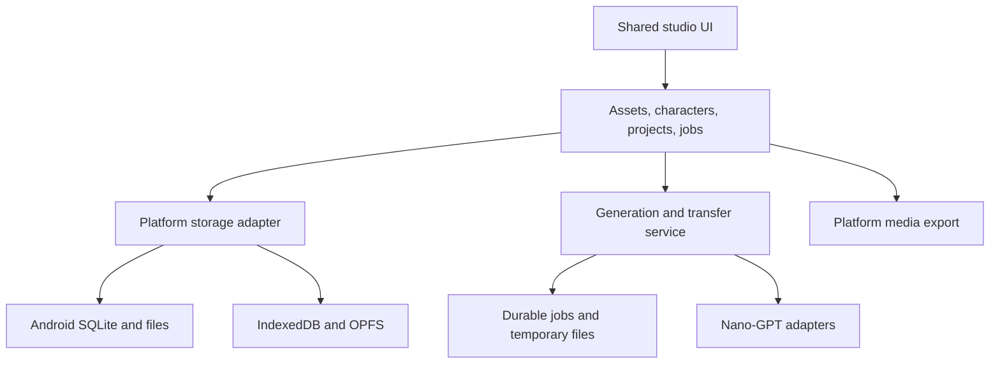
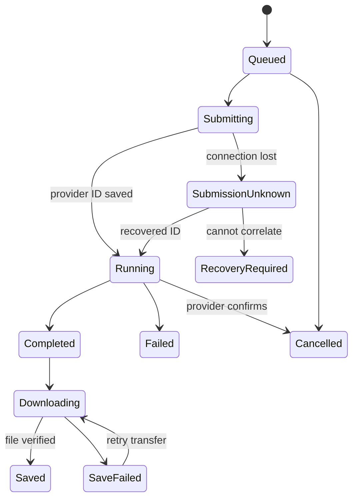

# char2vid product and architecture design

**Date:** 2026-09-13. **State:** proposed design, prepared for review and implementation planning. Saving this specification does not mean its assumptions have been individually approved or that the app exists.

**Goal:** Create a coherent Android-first studio in which a user can import or generate an image, establish a reusable character, cast that character into shots, animate selected frames, add sound, and export a finished video while keeping an organized local media library.

Research and API qualifications: [research report](../../research/2026-09-13-research.md). Delivery order: [master implementation plan](../plans/2026-09-13-char2vid.md).

## 1. Recommendation and assumptions

Build a **React/TypeScript web application packaged with Capacitor for Android**, with native SQLite metadata and app-owned media files. Add a small, durable generation service for Nano-GPT requests and temporary asset transfers. Ship the same UI as a PWA with browser storage adapters.

Assumptions made to produce a concrete plan:

1. The first release is a personal, single-owner studio. Multiple devices may be enrolled, but automatic library synchronization, collaboration, public accounts, and subscription resale are outside release scope.
2. The user supplies an app-specific Nano-GPT API key. Nano-GPT is the sole AI provider; local media encoding and file management are not inference providers.
3. Android packaged delivery is part of the first storage milestone, not a final wrapper added after web development.
4. A small self-hosted service with a persistent volume and public HTTPS endpoint is acceptable. This is a material architecture assumption: it adds hosting/maintenance costs in exchange for durable jobs and valid large-file reference URLs.
5. Initial product support floor is Android API 26. Actual compile/target SDK and JDK/Gradle pins must match the chosen Capacitor 8 template and release requirements, with build values committed in the foundation task.
6. Portrait 9:16 is the default project format. Other model-supported ratios remain available; existing assets retain their aspect ratio until the user chooses an explicit crop, pad, or reframe operation.
7. A portable character is a versioned reference package owned by this app. Training a LoRA, making a face embedding, or importing a proprietary Reallusion iModel is not assumed.

### Alternatives considered

| Approach | Advantages | Main cost or limitation | Decision |
|---|---|---|---|
| Shared PWA + Capacitor + small durable service | Shared UI, native files, reliable job monitoring, large reference staging | Requires a service and native bridges | Recommended |
| PWA alone, direct API calls | Easiest distribution and smallest deployment | Browser-managed storage and lifecycle; credentials and large reference transport need compromises | Useful secondary delivery, insufficient as the native-storage target |
| Fully native Kotlin application | Strong Android integration and media APIs | Separate implementation from the requested web app; higher UI duplication | Use Kotlin only at native boundaries |

## 2. Product boundaries

The complete target includes:

- Offline gallery with folders, collections, tags, favorites, ratings, trash, batch actions, provenance, and portable backups.
- Text-to-image, image editing, reference-based image generation, and compatible image utilities.
- Quick and detailed character creation, independent outfits/looks, revisioned reference sets, and character import/export.
- Project/cast/scene/shot structure, reusable prompts, story-to-shot assistance, selected-shot generation, alternative takes, and frame extraction.
- Image-to-video, text-to-video, and compatible reference/video-guided operations.
- Shared storyboard and node canvas, with explicit downstream dependencies.
- Voice, music, sound effects, compatible voice cloning, timed captions, simple timeline editing, and rendered export.
- Live model discovery, capability-aware controls, job recovery, visible cost estimates, and actual-cost records where available.

Excluded from this release: a 3D scene editor; skeletal rigging/mocap; character-model training; proprietary actor-file compatibility; cloud gallery synchronization; multi-user collaboration; a social feed; a full professional nonlinear editor; and automatic publishing to social platforms. These exclusions do not remove the end-to-end creation workflow.

## 3. Mobile navigation and interaction

Use four bottom destinations: **Library**, **Characters**, **Create**, and **Projects**. Jobs are a persistent status chip opening a queue sheet. Settings are available through the app menu. On larger screens, reuse these destinations in a side rail with a detail inspector.

| Surface | Required content | Primary actions |
|---|---|---|
| Library | Virtualized image/video/audio grid; folder/collection filter; sort/search; local/transfer status | Import, select, organize, use in creation, export |
| Asset detail | Fit-to-screen preview; provenance; related characters/shots; versions; prompt/parameters | Make character, animate, edit, use as reference, capture frame, share |
| Characters | Searchable character cards with cover, looks, approval state, recent use | Create, edit reference slots, change look, cast, export package |
| Create | Operation, selected model, reference tray, prompt, supported settings, estimate | Generate; save preset; attach result to character/shot |
| Project | Cast, scenes, shot list, storyboard/canvas switch, production status | Add scene/shot, generate selected shots, compare takes, open editor |
| Editor | Preview, shot sequence, audio/caption lanes, trim/reorder controls | Preview, save edit revision, export |
| Queue | Separate provider and local-save states; costs/errors; resumable transfers | Inspect, cancel queued work, retry transfer, recover job |

Interaction requirements:

- Minimum 48 CSS-pixel targets for primary touch controls; support Android back, safe areas, keyboard insets, TalkBack labels, and reduced motion.
- No hover-only actions, mandatory right-click, or drag-only reorder. Provide select/connect and move-up/down controls.
- Keep selected references and draft prompts when changing tabs, rotating, backing out, or restarting.
- Model settings belong in a bottom sheet. Show selected inputs, relevant settings, and estimated cost near Generate.
- Fullscreen media viewer uses fit by default. Grid crops affect thumbnails only.
- The canvas is an alternative editing view of the same project. Phone users can complete the entire workflow in the guided shot view.

## 4. End-to-end workflows

### 4.1 Image → character

1. Import an existing image or generate one. Preserve the original file and attach creation metadata.
2. Choose **Make character**, enter a name, and assign the image's role.
3. Quick mode accepts a single approved image and creates a usable character immediately. Additional angle generation is optional and visibly incurs generation cost.
4. Detailed mode offers identity portrait, full body, front/side/back/three-quarter angles, expressions, outfit/look references, and an optional existing character sheet.
5. Generated views start as candidates. The user can accept/replace individual views; a generated candidate never silently replaces the original identity anchor.
6. Commit a character revision; the character is available in every project without re-uploading its originals.

### 4.2 Character → shot image → video

1. Create or open a project, select its cast, and choose a look for each character.
2. Write a scene and shot, or request a structured draft from a compatible text model.
3. The app chooses proposed references by declared role and lets the user adjust them before generation.
4. Generate a composition/start frame; compare candidates and select a take.
5. Choose **Animate**. Carry the approved start frame, cast revision IDs, selected look IDs, and compatible references into the video composer automatically.
6. Define action, camera behavior, duration, sound, and supported end/reference frames. Preview the final prompt and input order.
7. Submit; leave the app if desired. The service records the job and downloads completed output into temporary staging.
8. The app copies the result into local storage, verifies it, and attaches it to the shot. The user may capture an exact video frame for the next shot.
9. A subsequent shot uses the selected continuity frame plus the original character references where supported. It does not repeatedly replace identity anchors with previous generated output.

### 4.3 Production → finished export

1. Select accepted takes, reorder and trim shots, and adjust the framing policy.
2. Generate/import dialogue, music, and sound effects. Bind voices to cast members independently of visuals.
3. Generate timed captions using a suitable transcription model, or import/edit SRT/VTT.
4. Preview a deterministic edit revision. Export its video, audio mix, and optional burned captions; alternatively export source clips with caption files and an edit manifest.
5. Save the finished file to the local library and optionally Android Gallery, Files, or the share sheet.

## 5. System architecture



Recommended stack:

| Component | Choice and responsibility |
|---|---|
| Shared UI | React, TypeScript, Vite; responsive CSS; lightweight local UI state; TanStack Query for remote state |
| Runtime contracts | Zod schemas and explicit serializers; unknown provider fields retained in metadata |
| Android shell | Capacitor 8; small Kotlin plugins for Room/SQLite, picker/export operations, credentials, and Media3 |
| Browser metadata | Dexie over IndexedDB, accessed only through the repository contract |
| Browser binary files | OPFS, with capability detection and a documented IndexedDB-Blob fallback for small assets |
| Server | Node 22+, Fastify, SQLite on a persistent volume, a durable worker, local staging directory served through signed HTTPS routes |
| Media handling | Native streams/ContentResolver and Media3 on Android; browser preview; server FFmpeg for browser rendered export |
| Graph view | React Flow, isolated from the persisted domain graph; guided view works independently |
| Verification | Vitest for domain/adapters; Playwright for web flows; Kotlin/instrumentation tests for native storage and export |
| Delivery | GitHub Actions for web checks, Linux service image, and Android APK builds; physical Android validation before release |

Do not implement the queue as an in-memory array or deploy its SQLite/staging directories on ephemeral function storage. The first deployment is a single service instance; horizontal scaling requires a later queue/database change.

## 6. Data ownership and persistence

| Data | Authoritative owner | Persistence policy |
|---|---|---|
| Original media and approved generated files | Device library | App-owned files; never removed by cache eviction |
| Thumbnails/waveforms/proxies | Device cache | Regenerable; LRU cleanup allowed |
| Projects, characters, prompts, revisions, local job receipts | Device database | Transactional writes and schema migrations |
| Active provider job and service receipt | Service database | Persist across process restart; reconcile to device receipt |
| Nano-GPT key | Service credential vault | Encrypted at rest with a key outside the database; never returned after initial configuration |
| Android service session credential | Android Keystore-backed storage | Re-enrollment after revocation; excluded from portable backup |
| Browser service session | Secure HttpOnly cookie | Same-origin service; CSRF protection for mutations |
| Uploaded references and downloaded pending results | Service temporary staging | Explicit expiry and storage quota; not the permanent gallery |
| Public model metadata | Service/device cache | Dated snapshots; preserve last successful catalog on fetch failure |

### Native storage mechanics

- Copy selected Photo Picker/SAF content into private app-owned files, recording its original name and MIME type. Do not rely on temporary picker grants as the only copy.
- Use content hashes for physical deduplication, but keep separate logical assets when provenance or organization differs.
- A media save has journaled stages: record pending import → stream to temporary file → validate/hash → atomic file promotion where supported → database transaction marks available.
- Reconcile incomplete journal entries at startup. A crash after file promotion must not lose a valid file or create duplicate assets.
- File handles and content URIs stay behind the adapter. Never send a `file:`, `content:`, `blob:`, or local WebView URL to Nano-GPT.
- Share through temporary `content://` grants; export images/video/audio through MediaStore and backups through SAF. Do not use HTML download links as the native save implementation.
- Display available space, original-media size, cache size, and backup status. Reject an import/export if its estimated working set cannot fit; preserve the originals on failure.

App uninstall and clearing app data remove private files. Backups and user-exported media are the survival mechanism; native storage is not a backup guarantee.

### Browser behavior

Request persistent storage where supported and show whether it was granted. Handle `QuotaExceededError` without discarding metadata or previously saved originals. An origin change or a separate Android installation has a separate library. Moving projects between them uses portable export/import until synchronization is deliberately implemented.

## 7. Domain records

All identifiers are app-generated UUIDs except opaque provider IDs. Dates are ISO UTC. Financial values use integer micro-USD or validated decimal arithmetic, not accumulated binary floating-point cents.

| Record | Important fields and invariants |
|---|---|
| `Asset` | ID, media kind, original filename, MIME, bytes, content hash, storage state, dimensions/duration, created time, favorite/rating, trash time |
| `AssetRevision` | ID, logical asset ID, immutable file hash, parent revision IDs, generation/import/edit provenance |
| `Collection` / `CollectionMember` | Independent organization without copying files; a folder tree is optional primary placement, collections are many-to-many |
| `Character` | Stable ID/name/cover and current revision pointer |
| `CharacterRevision` | Immutable approved reference IDs with role/view/approval; optional identity notes; associated look IDs |
| `CharacterLook` | Character ID, revision, wardrobe/hair/accessory/style choices, approved look reference IDs; never rewrites base identity |
| `VoiceBinding` | Character ID, model/provider-qualified voice ID or embedding asset, source audio, verification/expiry metadata |
| `Project` | ID, title, format, cast, scene order, graph draft, active edit revision |
| `ShotRevision` | Immutable text/action/camera/setting, cast revision bindings, selected reference roles, selected image/video takes, continuity-source frame |
| `PromptPreset` | Versioned text modules, applicable operations, owned user text, optional defaults |
| `GenerationRequest` | Operation, exact model ID, adapter version, catalog snapshot, prompt, reference bindings, parameters, client request ID, estimate |
| `GenerationJob` | Local receipt and service/provider IDs, lifecycle states, submitted request hash, cost status, outputs, timestamps, retry classification |
| `TimelineRevision` | Immutable ordered clips and timing, audio tracks, caption cues, crop/pad policy, output settings |
| `GraphNode` / `GraphEdge` | Stable node IDs, typed input/output ports, references to immutable revisions; layout data separate from semantic edges |
| `Transfer` / `BackupManifest` | Byte progress/checksum/expiry; archive schema version and relative file inventory |

A generation saves the user's raw prompt, any assistant proposal, the accepted final prompt, exact serialized request with secrets/temporary signatures removed, ordered reference hashes, route identity, returned IDs, and outputs. Recipe reproduction is supported; identical pixels are not guaranteed.

## 8. Shared contracts

These are proposed application contracts, not Nano-GPT wire schemas. Place them in `packages/domain/src/contracts.ts`; implementations validate corresponding runtime schemas.

```ts
export type MediaKind = 'image' | 'video' | 'audio' | 'embedding';
export type Operation =
  | 'text' | 'image-generate' | 'image-edit' | 'image-utility'
  | 'video-generate' | 'video-edit' | 'video-extend' | 'video-utility'
  | 'speech' | 'music' | 'sound-effect' | 'transcribe' | 'voice-clone';
export type ReferenceRole =
  | 'identity' | 'body' | 'look' | 'pose' | 'composition' | 'style'
  | 'start-frame' | 'end-frame' | 'motion' | 'voice' | 'continuity';
export interface ReferenceBinding {
  assetRevisionId: string;
  role: ReferenceRole;
  characterRevisionId?: string;
  ordinal: number;
}
export interface GenerationDraft {
  clientRequestId: string;
  operation: Operation;
  modelId: string;
  prompt: string;
  references: ReferenceBinding[];
  parameters: Record<string, unknown>;
  projectId?: string;
  shotRevisionId?: string;
}
export interface CapabilityIssue {
  code: string;
  field?: string;
  message: string;
  severity: 'blocking' | 'advisory';
}
export interface ModelDescriptor {
  id: string;
  catalog: 'text' | 'image' | 'video' | 'audio';
  fetchedAt: string;
  raw: Record<string, unknown>;
  operations: Operation[];
  verification: 'metadata' | 'contract-tested' | 'conflict';
}
export type SaveState = 'absent' | 'downloading' | 'verifying' | 'saved' | 'failed';
export type ProviderState =
  | 'queued' | 'submitting' | 'submission-unknown' | 'running'
  | 'completed' | 'failed' | 'cancelled' | 'recovery-required';
export interface JobReceipt {
  id: string;
  clientRequestId: string;
  providerRunId?: string;
  providerState: ProviderState;
  saveState: SaveState;
  outputRevisionIds: string[];
  errorCode?: string;
}
export interface PreparedInput {
  binding: ReferenceBinding;
  sha256: string;
  mime: string;
  bytes: number;
  source: { type: 'https'; url: string } | { type: 'data'; dataUrl: string };
}
export interface ProviderAdapter {
  validate(draft: GenerationDraft, model: ModelDescriptor): CapabilityIssue[];
  serialize(draft: GenerationDraft, inputs: PreparedInput[]): {
    url: string; method: 'POST'; body: unknown;
  };
  normalizeSubmission(status: number, body: unknown, contentType: string):
    { kind: 'ticket'; runId: string; rawTicket: unknown } |
    { kind: 'inline'; rawOutput: unknown };
}
```

Storage and transport interfaces are specified in their subsystem plans. Shared code never imports Android platform classes, Dexie, or filesystem paths directly.

## 9. Dynamic model discovery

### Discovery algorithm

1. Refresh each modality independently on first online launch, manual refresh, and when cached metadata is older than six hours. This interval is an app policy.
2. Read public catalogs to populate **All models**; merge authenticated metadata by exact ID without removing public records because of personalized visibility.
3. Annotate account eligibility and credential restrictions separately. Do not try to defeat a denied model restriction.
4. In each generation composer, default to compatible models and expose the remaining models with a reason they do not fit the current inputs. Favorites/recent filters never replace the full catalog.
5. Fetch image endpoint metadata on selection using its returned path. Resolve relative paths against Nano-GPT and reject other origins before attaching credentials.
6. Normalize all observed parameter shapes. Keep descriptors and wire values intact: the string `"5"` and number `5` are not assumed interchangeable.
7. Preserve unknown fields, unsupported control types, metadata conflicts, and source timestamps. Do not crash the entire catalog or silently drop a model.
8. On metadata failure, show the last successful catalog with its age. Empty first-run state shows retry; do not fabricate a fallback list.

### Availability versus verified operation support

A newly discovered model with a known, complete transport contract can be used immediately. A model that needs undocumented inputs stays visible with an actionable limitation. Add a tested adapter/override for that operation; do not pretend “all models loaded” means all models have been generation-tested.

Completion requires every record in current image/video/audio catalogs to be represented in the picker and accounted for in a compatibility audit: usable through a verified generic/family adapter, incompatible with the current operation, account restricted, or awaiting a specifically identified contract detail. A permanent curated allowlist is unacceptable.

Overrides must include exact model ID or verified route family, conflicting fields, source URL, date, regression fixture, and expiry/review date. Never infer compatibility from a marketing name or reuse Zeemo/Reallusion's reference limits.

## 10. Reference and prompt compiler

The compiler operates on immutable asset/character revisions and explicit roles.

- For image creation with identity references, preserve the referenced subject and describe only the desired change/scene. Optional user-authored identity notes remain available; do not auto-generate a long appearance restatement on every shot.
- Separate identity, look, pose, scene, and style. A wardrobe change updates a look/shot binding, not the character anchor.
- For image-to-video, carry the approved start frame. Extra identity/body/voice/motion/end references are attached only if the route supports their role.
- Multi-character shots retain per-character reference groups and stable ordinal assignments. UI `@Character` chips compile into an explicit binding description or verified provider syntax; arbitrary local names are not provider identity tokens.
- Show requested versus selected references when capacity is insufficient. Never silently drop a cast member, reorder references, or append every prior generation.
- Use the tightest verified route/provider input size/format limit. Derivatives may resize/compress specifically for transfer; originals remain untouched.
- A character sheet can be used as a reference only when the chosen route accepts it. Its multiple views do not create multiple independently addressable reference slots.
- If a video model accepts only one image, first compose the required characters into a shot image, then animate that image. Tell the user which extra references cannot be passed.
- Every generation stores the final ordered binding list and selected source hashes. Generation round two and later rebuild inputs from stored files, not expired URLs or thumbnail caches.
- Prompt-assistant changes are proposals shown in a diff/preview. Generate uses the accepted text, with prompt expansion disabled unless explicitly selected and supported.

## 11. Job service and charging semantics

The service exposes app-owned APIs under `/studio-api`; these are not Nano-GPT endpoints. A job is written before provider submission. The device gets a durable receipt immediately and can reconnect using `clientRequestId`.



Rules:

1. Enforce unique `(ownerId, clientRequestId)` and store a canonical request hash. A repeat with the same hash returns the existing receipt; the same ID with a changed payload returns conflict.
2. Use transactional worker leases so a service restart cannot cause two workers to submit the same queued job. A stale `submitting` lease becomes `submission-unknown`, not automatically queued.
3. There is no assumed provider idempotency key. A timeout after possible dispatch, or a process crash before an inline result is persisted, can remain ambiguous. Never automatically resubmit a potentially charged media generation.
4. Use video recovery only within its documented scope; correlate by strong evidence and require user selection when matches are ambiguous. Aggregate usage does not identify a missing result reliably.
5. Retry safe GET/status/download operations with bounded exponential backoff and jitter. Respect `Retry-After` and audio `X-Poll-After` when present. Initial media concurrency is two per owner; make it configurable.
6. Handle 400/413 with corrective input feedback, 401/403 with credential/access repair, 402 with insufficient-balance feedback, and daily 429 separately from transient rate limiting.
7. For media POST errors, retry automatically only when the adapter can establish non-acceptance; otherwise enter recovery. Never silently change the selected model.
8. Cancel unsent queued jobs locally. For already submitted work, “Stop waiting” does not assert provider cancellation, stop charges, or discard a late valid result.
9. Distinguish provider completion from service-staged output and device-saved output. Empty output, invalid media, partial downloads, and failed verification cannot become saved results.
10. Preserve every output when multiple images/takes return. Assign stable output ordinals; avoid collapsing a batch to its first item.

### Temporary files

Use stream-based uploads with a server-issued transfer ID and declared size/hash. First implementation supports 8 MiB chunks with idempotent part writes and an atomic finalize; the service exposes authenticated endpoints to the app and narrowly signed HTTPS GET URLs to Nano-GPT.

Reference URLs remain valid while their job is active. Renew them before dispatch; do not revoke them merely because submission was accepted. After a terminal job, keep references for 24 hours and then remove them. Keep unclaimed output staging for seven days, show the expiry to the app, and delete acknowledged results after a 24-hour grace period. These are app policies, not provider retention promises. Surface quota pressure instead of deleting active inputs.

An unresolved job keeps its input lease and a visible recovery state; an explicit user abandonment action releases it. Downloads from provider-returned URLs must reject private/link-local networks and unsafe redirects, enforce size/time limits, and never forward the Nano-GPT key to a storage host.

## 12. Credentials, network boundaries, and service operation

The personal service is bootstrapped by its owner through a one-time setup token generated at deployment. Setup establishes an owner login; Android enrollment returns a revocable device token, while the browser uses a secure session cookie. Do not commit the setup token, owner credential, encryption key, or Nano-GPT key.

Settings submits the user's Nano-GPT key over TLS to the service, validates it through an authenticated non-generating endpoint, and retains only a masked label on the client. The service stores it encrypted. Public catalog success does not validate a key. Removing a device revokes its service access without deleting the offline library.

Optional OAuth is a later convenience in the same architecture: service-owned HTTPS callback, state/S256 validation, encrypted storage of the returned app key, and a separate app session. Do not transmit Nano-GPT credentials in Android callback URLs.

The service needs a persistent volume, HTTPS termination, bounded job concurrency, staging quotas, database backup, health/readiness endpoints, structured secret-redacted logs, restart reconciliation, and dependency updates. Deployment instructions must state CPU/disk assumptions and measured resource use; do not invent a hosting-price estimate.

## 13. Costs

Generate shows an estimate or explicitly says it is unknown. Estimate by the exact model/route/settings and source durations; do not treat all models as per-image or per-output-second. Reserve estimated cost for concurrent queued work when applying an app spend limit. An estimate is not a provider quote or a strict final cap.

Record estimate, provider-reported final cost, and refund/unknown states separately. Reconcile aggregate usage as a diagnostic without assigning a whole aggregate bucket to one job. Optional paid prompt assistance, cloning, upscaling, and transcription are visible operations rather than hidden automatic fees.

## 14. Storyboard, graph, and editing

The domain graph represents reusable inputs and generation/edit operations. Storyboard order is a project timeline, not the same thing as graph topological order.

- Ports are typed (`image`, `video`, `audio`, `character`, `text`). Validate compatible edges and reject execution cycles.
- Draft node edits do not mutate completed jobs. Running a node freezes its upstream revision references and creates a new result revision.
- Upstream changes mark affected downstream drafts as out of date, retaining accepted output and the original input revision. Rebuild only selected descendants after showing scope and estimated cost.
- Persist semantic edges independently of canvas positions. A missing canvas library must not prevent shot-list editing.
- Clip timing uses integer microseconds; caption times remain aligned after trim/reorder. Keep source intervals and output timeline intervals distinct.
- Initial rendered editor supports cuts, trimming, fit/pad/crop, volume/mute, narration/music mixing, and captions. Crossfades, speed ramps, keyframes, and elaborate effects require separate verified implementations.
- Native export uses Media3 through a plugin. Browser export uses the service's FFmpeg renderer after selected assets are staged. The edit manifest is the shared contract; pixel-identical encoders are not promised.
- A source bundle includes originals, selected takes, SRT/VTT, and the edit manifest; it remains available when rendered export is unsupported or storage is insufficient.

## 15. Audio and captions

Discover all audio records. Distinguish speech, music, sound effects, transcription, cloning, and transformations from metadata and verified adapters. Do not route every audio model through TTS merely because it appears in the audio catalog.

Voice identity belongs to a character but is qualified by provider/model compatibility. Persist returned IDs; download portable embedding files as assets where available and rehost a transfer copy when a route requires HTTPS. Model-specific retention/activation rules require current verification, not assumptions.

For captions, require a model with word or segment timestamps. Store language, speaker, interval, text, and source audio revision. If only plain text returns, show a transcript and offer timing through a suitable model or manual editing. Do not fabricate precise word timings.

## 16. Backups and portability

Use versioned ZIP packages with JSON manifests and media files, streamed on Android and the service. Full backup, project package, and character package share an archive core.

- Use relative paths, hashes, byte lengths, MIME types, schema version, and dependency IDs.
- Include original reference files, selected generated assets, looks, prompts, and edit metadata. Derivative thumbnails can be regenerated.
- Exclude credentials, cookies, presigned URLs, internal absolute paths, and transient provider authentication material.
- Validate ZIP paths, expanded size, file count, hash, duplicate IDs, and supported schema versions before importing. Reject traversal and decompression bombs.
- Import into a staging transaction; remap conflicting IDs and every related edge/binding consistently. Show missing optional dependencies; required missing files block commit.
- Support restore onto a fresh installation and migration from the browser to Android. Never overwrite an existing project silently.

## 17. Performance and offline behavior

Acceptance budgets are initial engineering targets to measure, not claims of achieved performance:

| Scenario | Target |
|---|---|
| Offline library first usable grid | Within 2 seconds on the reference Android device with 5,000 indexed assets |
| Local filter/search after warm start | P95 under 200 ms for indexed fields at 5,000 assets |
| Scroll | Virtualize rows; no full-resolution decode for offscreen thumbnails; measure jank on device |
| Media transfer | Stream/chunk; do not allocate a full large video in JavaScript memory |
| Large backup | 1 GiB round trip without holding the archive in memory |
| Interrupted job | Reopening resolves to the existing receipt; no automatic duplicate paid request |
| Offline creation | Drafts, organization, character edits, project edits, playback, and eligible local exports work; generation waits for connectivity |

Metadata and draft saves occur transactionally/debounced with a flush on relevant lifecycle events. A lost network connection cannot erase a local edit. Pending provider jobs are reconciled on service restart and on app resume; push notifications are optional, not required for correctness.

## 18. Required validation before release

- Real Android import, restart, rotation, backgrounding, process death, low storage, and permission-denial cases.
- Duplicate import, deduplicated physical file retention, shared asset deletion, trash restore, and migration recovery.
- New catalog record without an application release; duplicate display names; one catalog offline; unknown descriptors; conflicting capabilities; model removal.
- One-input and multi-input image routes; masks where supported; all returned images; two consecutive rounds of image → shot → video creation.
- Timeout before/after submission, worker crash before receipt persistence, lost phone connection, status schema variants, duplicate callback/poll processing, expired output URL, and interrupted download.
- Two characters with separate looks and voices; no cross-assignment of references.
- Native export and browser export with mixed clip sizes, rotated media, trimmed audio, Unicode captions, and unsaved source dependencies.
- Portable character, project, and full-library restore with matching media hashes and valid graph links.

Paid checks are a separately budgeted implementation activity. Unit and fixture tests must not spend provider credits. Catalog retrieval is not evidence that generation, identity preservation, or native export works.

## 19. Decisions to revisit only if the premise changes

The main future decision is whether to accept the small service. If the user requires zero server, revise job guarantees, key storage, large reference transport, and browser export together before implementation. Likewise, cloud sync, public SaaS, 3D editing, or proprietary character import each require a separate design extension. None should be quietly added to this release.

## 20. Global implementation constraints

- Android API 26 is the product support floor.
- Node 22+ and Capacitor 8 are the initial platform baseline.
- Nano-GPT is the sole AI provider.
- Originals and approved outputs are never cache.
- All available model records must remain discoverable by exact ID.
- Potentially accepted media submissions are never retried automatically.
- Credentials and temporary signed URLs are excluded from portable exports and logs.
- Automated fixture tests must not spend provider credits.
